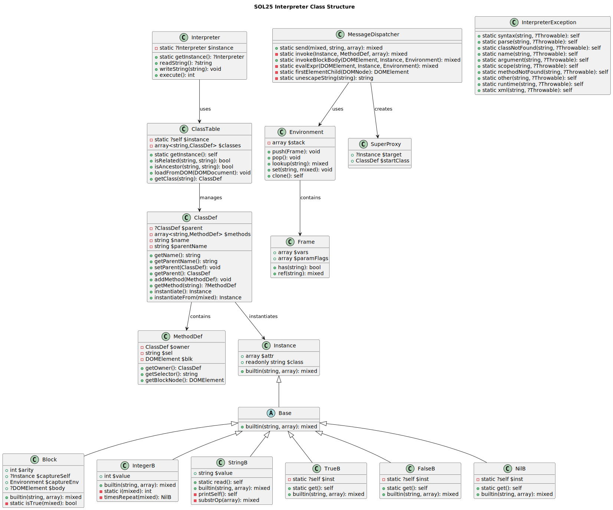
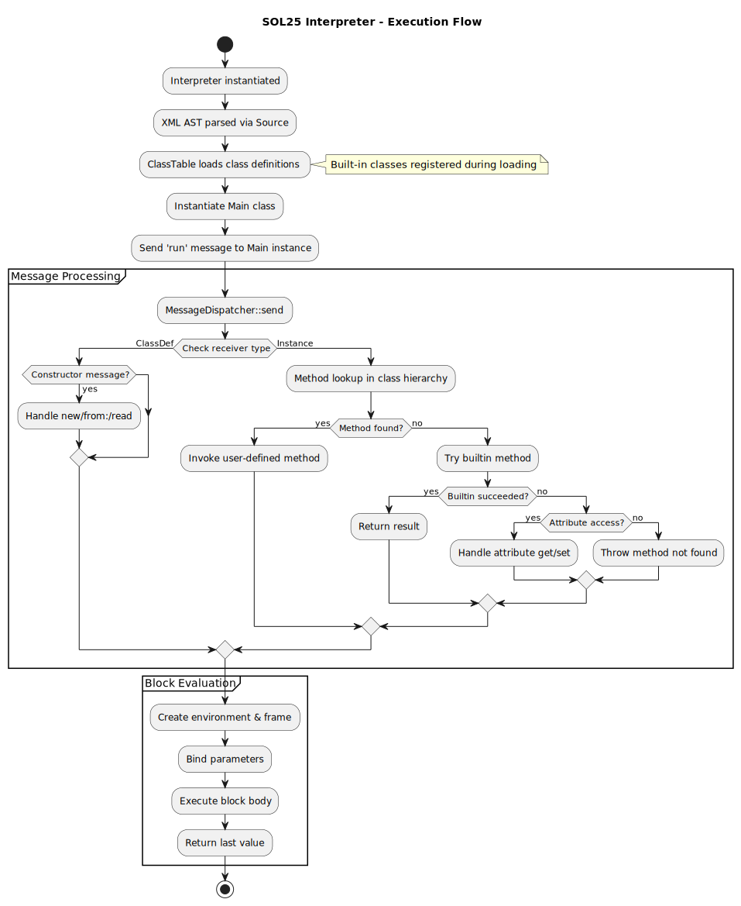
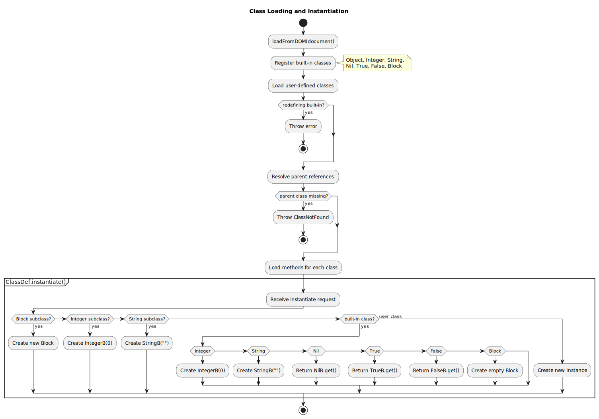
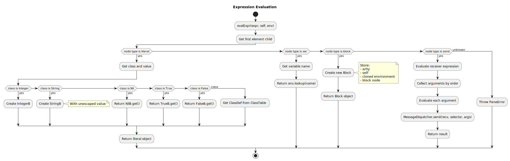
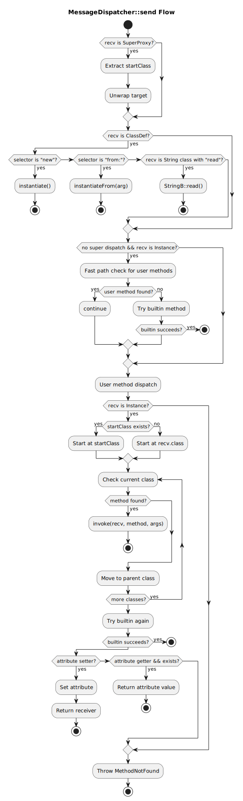
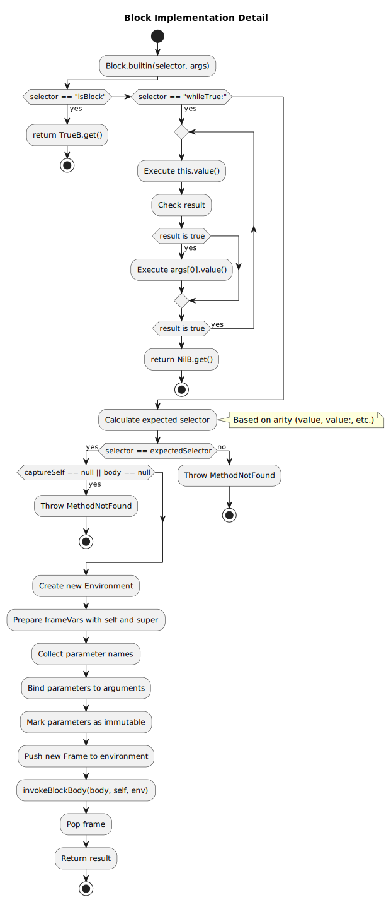

Implementační dokumentace k 2. úloze do IPP 2024/2025  
Jméno a příjmení: **Martin Ševčík**  
Login: **xsevcim00**

**Evaluation:** "Celkem bez rozšíření: 93 %" --> **15/13**

## Introduction

This document details my implementation of the SOL25 interpreter for IPP Project 2.

## Architecture Overview

This SOL25 interpreter follows an object-oriented approach where all elements are represented as objects, all operations happen through messages with dynamic dispatch. It uses a class hierarchy to inherit the behavior of specific classes. Blocks capture their definition environment for later execution.

I tried my best to create a clean design that follows OOP principles, especially the use of singletons for global state managing and proxy for handling inheritance. 

## Core Infrastructure

## System Integration

When a SOL25 program executes, the components interact in a structured sequence:

1. The `Interpreter` starts by parsing XML code, loading built-in classes
2. The `ClassTable` registers the classes
3. The Main class instance gets created and receives the run message
4. Messages start going through the `MessageDispatcher`, triggering appropriate behaviors
5. Methods and blocks execute in their environments
6. Results go through the message chain

## Key Classes:

### Interpreter

The `Interpreter` is the starter point of this system, I used a singleton approach for I/O handling. At start the Interpreter:

- Parses the XML loads class definitions from `ClassTable` 
- Instantiates the Main class 
- Invokes its run method, and begins the program execution.

### MessageDispatcher

This is the most important component of this interpreter, because it is responsible for routing all messages between objects. It follows a priority system that:

1. First evaluates special cases (constructors, super calls)
2. Searches for user-defined methods in the receiver's class hierarchy
3. Attempts built-in methods
4. Checks for attribute accessing
5. If all else fails -> throws an error

Built-in methods are called directly when no user-defined methods override them. This helps the interpreter avoid unnecessary lookups through the inheritance chain, making common operations on built-in types much faster.

#### Expression Evaluation

The `MessageDispatcher` handles recursive expression evaluation through its `evalExpr` method, which processes different kinds of expressions:

- Literals: Creates built-in objects (Integer, String, True, False, Nil)
- Variables: Looks up values in the current environment
- Blocks: Captures the current environment and self reference
- Message sends: Evaluates the receiver and arguments and then dispatches the message

### Instance

This is the basic fundation of the Object model. All objects inherit from this class, which keeps the object's class name and hash map of attributes.
It also implements methods such as `identicalTo:` and `equalTo:` and other.

### Base and Built-in Types

The `Base` abstract class extends `Instance` to provide common functionality for all built-in types. Each of these types implement its own version of the `builtin()` method. The built-in types are:

- `IntegerB`: Implements arithmetic operations, comparisons, and control structures
- `StringB`: Handles string manipulation, I/O operations, and conversions
- `TrueB` and `FalseB`: Provide boolean operations and conditional execution
- `NilB`: Represents the absence of a value

(I would have loved to exclude the B but PHP's built in types don't allow me to)

#### String Processing

The `StringB` class has some specific features that were tricky to implement. It handles special string operations like substring extraction with 1-based indexing and implements string escaping/unescaping for characters like newlines and quotes. The `unescapeString` method in the MessageDispatcher makes sure literals are properly interpreted.

### ClassDef and ClassTable

The `ClassDef` is basically a blueprint that stores the class name, the parent, and the method definitions. 

The `ClassTable` is a singleton that manages all class definitions in the interpreter. It handles registration of both built-in classes (at start) and user-defined ones. Goes through the inheritance chain to resolve the inheritance relationships and to verify class ancestry, and method looking up.

#### Instantiation Strategy

The `ClassDef` class uses different approaches to create instances based on class hierarchy:
- For built-in types, it returns singletons (True, False, Nil) or new instances with default values
- For subclasses of built-ins, it preserves the proper inheritance chain
- For user-defined classes, it creates generic instances
- The `instantiateFrom:` method enables copying instance state, handling both primitive attributes and user-defined ones

### MethodDef

This class represents a method definition. Its a clean encapsulation of method metadata and implementation details.

### Environment and Frame

The `Environment` class manages variable scope using a stack-based approach. It's similar to last semester's IFJ symbol table, where each `Frame` represents a scope and it stores variables and tracks parameter flags (for reasignment checking). The Environment can:

- Look up variables across scopes
- Handle assignments (with immutability)
- Maintain the scope boundaries

### Block Execution

One of the more complex classes, it implements executable code blocks with closure semantics, it also implements `whileTrue:`. This class captures:

- The lexical environment (variables in scope when defined)
- The self reference
- The block body (AST node)
- Parameters and their bindings

#### Control Flow Implementation

The `Block` class handles control structures like `whileTrue:` by continuously evaluating the receiver block until it returns false. This way I could use the message-passing approach for control flow too, instead of relying on PHP's built-in control statements.

### Flow diagrams for the more interesting parts

| Message Dispatcher |Block Execution |
|:------------------:|:---------------:|
|  |  |

### SuperProxy
I think a smart way to handle "super" is by defining a `SuperProxy` class that makes method calls to parent classes possible. It wraps the original receiver and states which class to begin the method lookup from.

### Dynamic Attribute Access
I handle dynamic attribute access with getter and setter message conventions.
When a message doesn't match any method, the interpreter checks if it's either a getter (without `:`) or a setter (with `:`).

## Error Handling

The `InterpreterException` extends the `IPPException` from ipp-core. It provides structured error handling with specific error codes for parse (22), argument (33), runtime (52, 53) and other errors.

## Conclusion

This implementation of the SOL25 interpreter applies a good amount of object-oriented principles in the cleanest way that I could possibly make. It's given me a deeper appreciation for how OOP programming languages actually work.

### My thoughts on this project
This was probably the best project on FIT in terms of creativity and learning a central topic for this subject. But in terms of time management, it was severely understated how much this project will take the average student, and definitely does not align with the amount of maximum points for this project. While the lectures did provide some info on OOP, I'd appreciate some better guidance on interpreter design patterns that would have been beneficial from the start. I had to start over multiple times, my initial approaches were either too complex and confusing or they couldn't scale with more advanced features.
